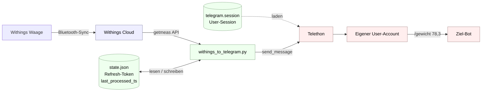

# withings-to-telegram

Holt neue Gewichts-Messungen aus einem Withings-Konto und schickt sie als `/gewicht XX,X` an einen Telegram-Chat — unter dem **eigenen User-Account**, nicht über einen eigenen Bot.

## Sicherheits-Hinweis vorab

Dieses Skript nutzt die Telegram **User-API** (MTProto) und legt eine Session-Datei an, die wie ein zusätzlich angemeldetes Telegram-Gerät funktioniert. Wer die Datei `telegram.session` aus dem Projektordner kopiert, kann sich unbegrenzt als der eingeloggte Account in Telegram ausgeben. `telegram.session`, `.env` und `state.json` sind in der `.gitignore` und gehören nicht in Backups, die woanders landen. Für persönliche Automatisierung (eine Nachricht pro eigener Wiegung an einen Empfänger) ist die User-API toleriert; spam-artige Nutzung kann das Telegram-Konto kosten.

## Warum User-API statt Bot-API

Wenn der Zielbot ein **fremder** Bot ist, blockiert Telegram Bot-zu-Bot-Nachrichten — der Empfänger-Bot sieht sie nicht. Ein eigener Bot in einer gemeinsamen Gruppe scheitert am gleichen Filter. Die Nachricht muss aus einem User-Account ausgehen.

Dafür gibt es Telegrams MTProto-Client-API, im Gegensatz zur HTTP-Bot-API. Bewährte Library: **Telethon**. Nach einmaligem Login per Telefonnummer + Login-Code (und ggf. 2FA-Passwort) wird eine Session-Datei angelegt, mit der das Sync-Skript danach ohne weitere Interaktion senden kann.

## Funktionsweise



Das Skript pollt — kein Webhook, kein Backend. Withings-Refresh-Token rotiert mit jedem Lauf, der neue Token landet sofort in `state.json`. `last_processed_ts` ist der Unix-Timestamp der zuletzt verschickten Messung. Nur Messungen mit `date > last_processed_ts` werden gesendet.

## Voraussetzungen

- Python 3.10 oder neuer (Standardbibliothek + Telethon)
- Withings-Konto mit Waage (z. B. Body+, Body Smart, Body Comp)
- Telegram-Konto mit Telefonnummer, 2FA dringend empfohlen
- Username (oder Chat-ID) eines Ziel-Bots oder -Chats

## Dateien

| Datei | Zweck |
|---|---|
| `withings_to_telegram.py` | Haupt-Skript, vom Scheduler aufgerufen |
| `init_oauth.py` | einmaliger OAuth-Flow für Withings |
| `init_telegram.py` | einmaliger Telegram-User-Login |
| `setup_venv.sh` | legt `.venv/` an und installiert Telethon |
| `requirements.txt` | Pip-Dependencies (`telethon`) |
| `.env.template` | Vorlage für `.env` |
| `.env` | wird manuell angelegt — **nicht** committen |
| `.venv/` | Python-Umgebung — nicht committen |
| `state.json` | vom Skript geführt — nicht committen |
| `telegram.session` | von Telethon geführt — nicht committen |
| `withings_to_telegram.log` | Lauf-Log — nicht committen |

## Einmalige Einrichtung

### 1. Repository klonen

```bash
git clone https://github.com/staude/withings-to-telegram.git
cd withings-to-telegram
```

### 2. Withings Developer App

1. Auf [developer.withings.com/dashboard](https://developer.withings.com/dashboard/) einloggen.
2. „Create an app“ → Public Cloud API.
3. Callback URL: `http://localhost:8765/callback`.
4. `Client ID` und `Consumer Secret` für die `.env` notieren.

### 3. Telegram API-Credentials

1. Auf [my.telegram.org](https://my.telegram.org) mit der eigenen Telefonnummer einloggen.
2. „API development tools“ → neue App anlegen. Plattform `Desktop` reicht.
3. **Wichtig**: `App title`, `Short name` (nur alphanumerisch, **keine Leerzeichen**), `URL` (irgendeine eigene erreichbare Adresse) und `Description` ausfüllen — Telegram wirft sonst ein generisches `ERROR`. Bei wiederholtem `ERROR` für 24 Stunden warten (Rate-Limit) und im Inkognito-Fenster ohne Browser-Extensions erneut versuchen.
4. Telegram liefert `api_id` (Zahl) und `api_hash` (Hex-String).

### 4. Ziel-Bot kennen

Username (z. B. `@DerFremdeBot`) oder numerische Chat-ID des Ziels in `TELEGRAM_TARGET` eintragen. Den fremden Bot vorab einmal **manuell** aus der Telegram-App anschreiben — erst dann darf ein API-Client Nachrichten dorthin senden.

### 5. `.env` befüllen

```bash
cp .env.template .env
$EDITOR .env
```

Felder: Withings-ID + Secret, Telegram-API-ID + Hash, Telefonnummer mit Ländervorwahl (`+49…`), `TELEGRAM_TARGET`.

### 6. Python-Umgebung aufbauen

```bash
bash setup_venv.sh
```

Legt `.venv/` an und installiert Telethon.

### 7. Withings-OAuth

```bash
.venv/bin/python init_oauth.py
```

Startet lokalen Empfangs-Server auf `localhost:8765`, öffnet Withings-Auth-URL im Browser, schreibt Refresh-Token in `state.json`.

### 8. Telegram-Login

```bash
.venv/bin/python init_telegram.py
```

Fragt nach dem Login-Code (Telegram schickt ihn in die App; nach Cooldown auch per SMS). Falls 2FA aktiv, kommt eine zweite Eingabe. Am Ende liegt `telegram.session` im Ordner, und das Ziel wird testweise aufgelöst.

### 9. Trockenlauf

```bash
.venv/bin/python withings_to_telegram.py --dry-run
```

Listet, was geschickt würde, ohne den Telegram-Send auszuführen. Setzt aber `last_processed_ts` auf den neuesten Eintrag. Wenn die echte Erstmeldung an Telegram gehen soll, danach `last_processed_ts` in `state.json` auf `0` zurücksetzen.

Echter Lauf:

```bash
.venv/bin/python withings_to_telegram.py
```

## Scheduling

Das Skript ist zustandslos im Sinne der Aufrufart — egal ob cron, systemd-timer, launchd oder ein anderer Scheduler. Beispiel-Crontab für einmal täglich um 10:00:

```cron
0 10 * * * cd /pfad/zum/projekt && /pfad/zum/projekt/.venv/bin/python withings_to_telegram.py
```

Frequenz nach Geschmack — Withings hat keinen Push-Webhook im Free-Tier, also pollt das Skript. Einmal am Tag reicht, wenn meist morgens gewogen wird. Alle 15 Minuten ist auch unproblematisch.

## Fehlerverhalten

- Withings-Refresh-Token-Tausch schlägt fehl → loggt Fehler, beendet ohne State-Update. Beim nächsten Lauf wird derselbe Token erneut probiert. Schlägt das dauerhaft fehl, ist der Refresh-Token bei Withings invalidiert — `init_oauth.py` erneut laufen lassen.
- Telegram-Session abgelaufen oder nicht autorisiert → Skript bricht mit Fehler ab, `last_processed_ts` bleibt unverändert. Lösung: `init_telegram.py` einmal interaktiv laufen lassen.
- Telegram-Send schlägt fehl (Rate-Limit, Ziel nicht erreichbar) → `last_processed_ts` wird **nicht** erhöht, der Eintrag wird beim nächsten Lauf erneut versucht.
- Withings liefert keine neuen Messungen → Skript beendet sich still, kein Telegram-Call.

Exit-Codes: `0` Erfolg (auch wenn nichts zu tun war), `1` Konfigurationsfehler, `2` API-Fehler.

## Wartung

- `state.json` und `telegram.session` werden automatisch geführt, normalerweise nichts zu tun.
- Bei Withings-Token-Verlust: `init_oauth.py` erneut.
- Bei Telegram-Session-Verlust (z. B. nach „alle anderen Geräte abmelden“ in den Telegram-Settings): `init_telegram.py` erneut.
- Telethon gelegentlich aktualisieren: `bash setup_venv.sh` erneut.

## Lizenz

GNU General Public License v3.0 — siehe [LICENSE](LICENSE).

Copyright (C) 2026 Frank Neumann-Staude.
